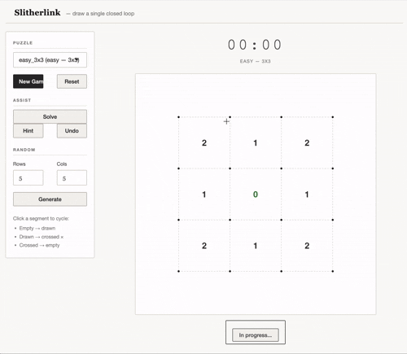

# slitherlinkshiny

An R package for playing and solving [Slitherlink](https://en.wikipedia.org/wiki/Slitherlink) logic puzzles, with a full interactive Shiny application.



## What is Slitherlink?

Slitherlink is a logic puzzle played on a rectangular grid of dots. The goal is to draw segments between adjacent dots to form a **single closed loop** — no branches, no crossings, no dead ends. Numbers inside cells indicate exactly how many of the cell's four edges belong to the loop.

```
+   +   +   +
  2   1   2
+   +   +   +
  1   0   1
+   +   +   +
  2   1   2
+   +   +   +
```

The unique solution for this 3×3 puzzle is the outer rectangle.

---

## Installation

```r
# Install from GitHub
devtools::install_github("marouanedaoudi/slitherlink-shiny")
```

Or load locally from source:

```r
devtools::load_all()
```

---

## Shiny app

```r
run_app()
```

Features:

| Button | Action |
|---|---|
| **New Game** | Load the selected puzzle |
| **Reset** | Restart the current puzzle |
| **Solve** | Fill in the complete solution |
| **Hint** | Reveal one correct segment |
| **Undo** | Revert the last action |
| **Generate Random** | Create a random solvable puzzle |

- Click near any segment to cycle its state: empty → drawn → crossed → empty
- Status indicator shows *In progress*, *Constraint violated*, or *Puzzle solved!*
- MM:SS timer starts on the first move or hint and freezes when the puzzle is solved

---

## R API

### Puzzles

```r
list_puzzles()                  # browse the built-in library
g <- get_puzzle("medium_4x4")   # load a puzzle (segments reset to empty)
g <- random_puzzle(n = 5, m = 5, seed = 42)  # generate a random puzzle
```

### Grid manipulation

```r
# Build a grid from a clue matrix (NA = unconstrained cell)
clues <- matrix(c(2, 1, 2,
                  1, 0, 1,
                  2, 1, 2), nrow = 3, byrow = TRUE)
g <- init_grid(clues)

# Toggle a segment (0 → 1 → -1 → 0)
g <- toggle_segment(g, type = "h", i = 1, j = 1)  # horizontal
g <- toggle_segment(g, type = "v", i = 2, j = 3)  # vertical

print(g)  # ASCII display in the console
```

### Validation

```r
check_clues(g)               # no clue exceeded (in-progress check)
check_clues(g, strict = TRUE)# all clues exactly matched
check_loop(g)                # segments form a single closed loop
is_solved(g)                 # full solution check
```

### Solver

```r
sol <- solve_grid(g)   # constraint propagation + backtracking
is_solved(sol)         # TRUE
```

`solve_grid()` returns `NULL` if no solution exists.

---

## Grid representation

A `slitherlink_grid` object contains three matrices:

| Field | Dimensions | Meaning |
|---|---|---|
| `clues` | n × m | Clue values (`NA` = no clue) |
| `seg_h` | (n+1) × m | Horizontal segment states |
| `seg_v` | n × (m+1) | Vertical segment states |

Segment values: `0` = empty, `1` = drawn, `-1` = crossed.

---

## Built-in puzzles

| Name | Difficulty | Size |
|---|---|---|
| `easy_3x3` | Easy | 3×3 |
| `easy_4x4` | Easy | 4×4 |
| `medium_4x4` | Medium | 4×4 |
| `medium_5x6` | Medium | 5×6 |
| `hard_5x5` | Hard | 5×5 |
| `hard_6x6` | Hard | 6×6 |
| `hard_7x7` | Hard | 7×7 |

---

## Package structure

```
R/
  grid.R          # init_grid(), toggle_segment()
  validation.R    # check_clues(), check_loop(), is_solved()
  puzzles.R       # list_puzzles(), get_puzzle()
  solver.R        # solve_grid()
  random_puzzle.R # random_puzzle()
  app.R           # run_app()
inst/shiny/app.R  # Shiny application
tests/testthat/   # 77 tests
vignettes/        # Introduction vignette
```

---

## Documentation

Full reference and vignette: <https://marouanedaoudi.github.io/slitherlink-shiny/>
